# How to Python, Set up Django and use PostgreSQL as database
## Introdution
This tutorial will guuide through the installation of Python followed by installing Django and setup PostgreSQl as default database.

## Python installation
---
## Installation on Windows

### Prerequisites

A Windows PC with  internet.

### Step1-Download Python

- Open any internet browser and go to **[python.org](https://www.python.org/downloads/)** .

Select your version of interest.(3.x is recommended)

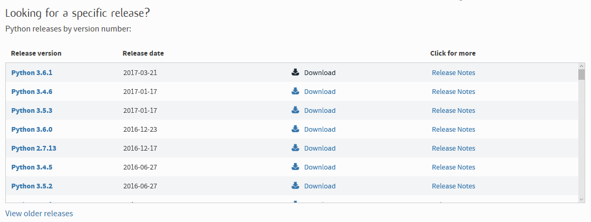

- Choose installer for download.

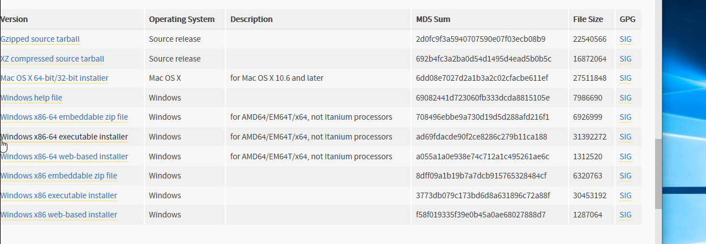

### Step2-Install Python and its components

- After completion of download open the installer and select **install now** and **Add python to path** for installing python components such as pip and adding python to path.

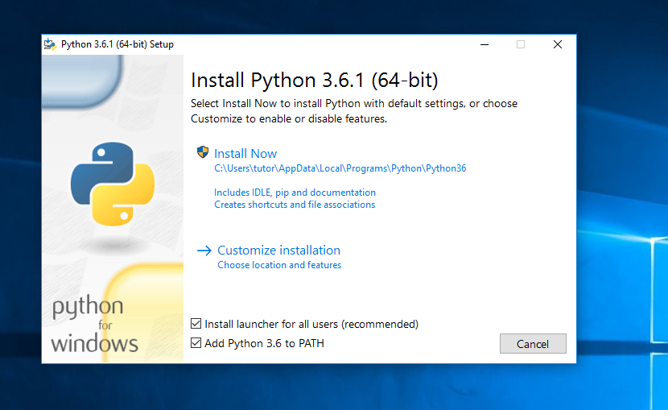

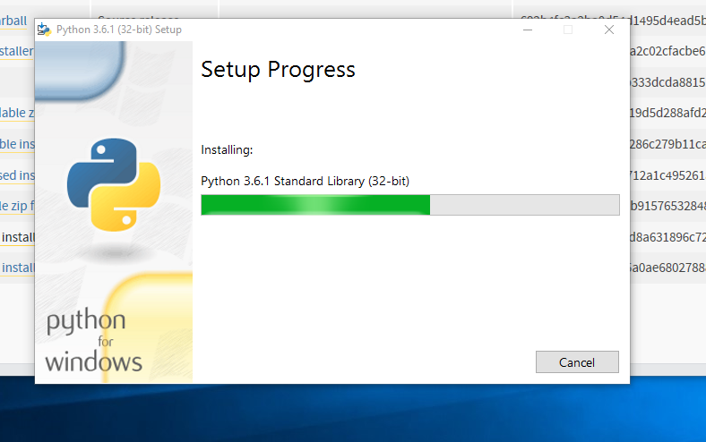

### Step3-Setting up path and testing environment

- Wait for installation to complete it may take a while.

- Now let us check whether the environment is working or not.

Open command prompt and type
```bash
python --version

```
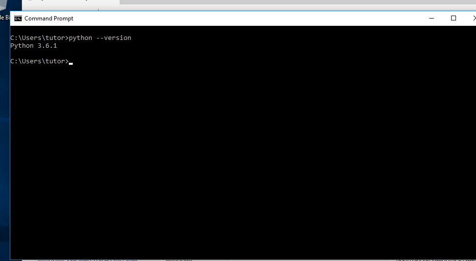

- If you did'nt get version as in above image that means you either did'nt choose add python to path or you went for custom installation.

- No worries, you can add python to path by yourselves by
Go to `Control Panel > System and Security > System` go for `Advanced system setting > Environment Variables` and then select path, edit the path by adding  `C:\Users\ *username*\App Data\Local\Programs\Python\ *Pythonfoldername*` if python was installed users folder otherwise add `C:\ *Python folder name*`.

- Now python environment works. Lets test with a hello program then.
Open notepad and write a hello program as below and save it with *.py* extension.
```python
print('Hello, Welcome to Python')
```
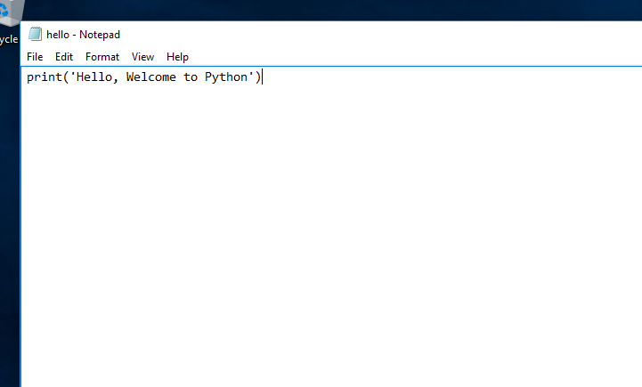

Now open command prompt at location(press *Shift+Mouse Right Click*) of *.py*(python file) file and type `python hello.py`(in my case). It gives an output as follows.

```bash
Hello, Welcome to Python
```
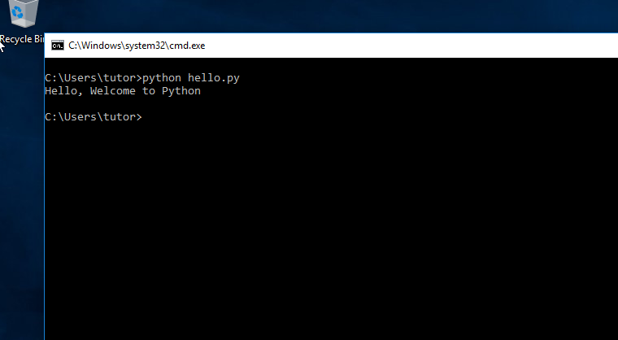

Congos! :sunglasses: you successfully installed and did set up the Python programming environment in your Computer :clap:.

## Installation on Ubuntu

### Prerequisites

A Ubuntu machine with internet and root access.

### Setting up Python../assets/

- We are using non graphical way(using command line) for setting up python in your machine.On both Ubuntu 16.04 and 15.04, you can find terminal application by either clicking **ctrl+Alt+t** or using the search by pressing **ubuntu button**.

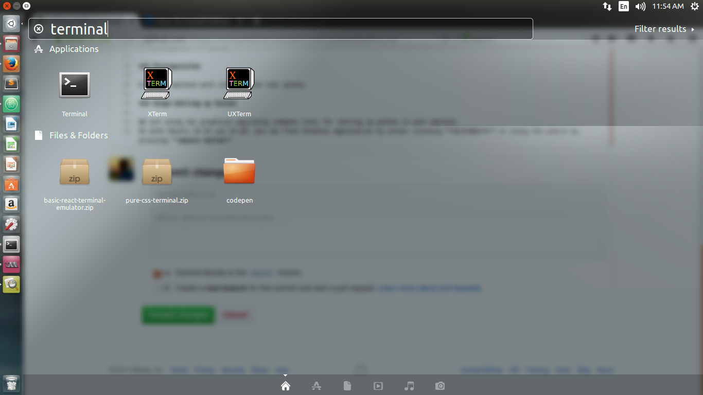

Ubuntu ships with both Python 3 and Python 2 pre-installed. To make sure that our versions are up-to-date, let’s update and upgrade the system with `apt-get`:

```bash
sudo apt-get update
sudo apt-get -y upgrade
```

Once the process is complete, we can check the version of Python  that is installed in the system by typing:

```bash
python --version
python3 --version
```
16.04(customized the profiles of terminal, so don't panic if you see a different coloured terminal)

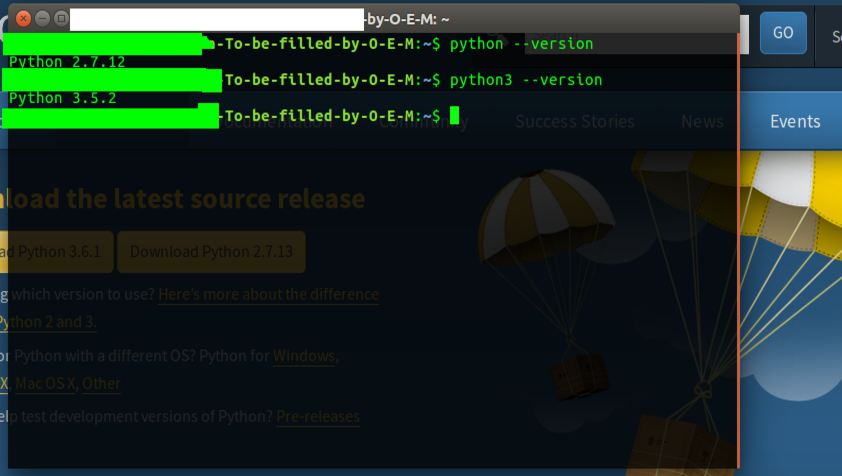

15.04

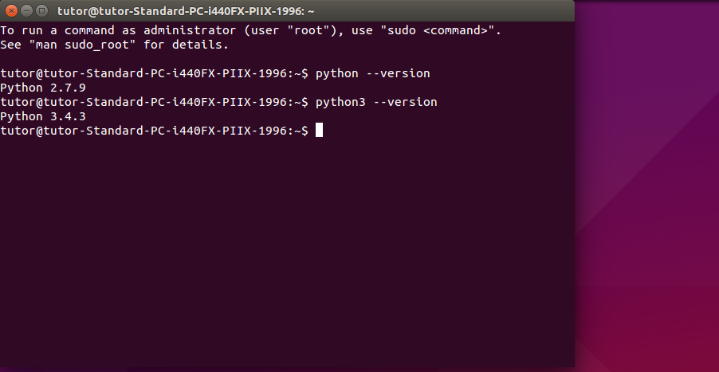

The output should be similar to above images(the version may vary).


To manage software packages for Python, let’s install **pip**:

```bash
sudo apt-get install -y python3-pip
```
**pip** is a package manager that manages the programming packages in developing projects.

we can install new packages using pip by:

`pip install `*packagename*

There are a few more packages and development tools to install to ensure that we have a robust set-up for our programming environment:

```bash
sudo apt-get install build-essential libssl-dev libffi-dev python-dev
```
Congos! :sunglasses: you successfully  set up the Python programming environment in your Computer :clap:.

---
## Django installation
---
## Prerequisites

- Ubuntu - 64bit with python environment set.
- Root privileges.


## Step1- Setup python3 as default Python version

This step is necessary because python3 is current version and some of the python2 functions might get removed, So let's make sure default version is python3

```bash
python --version
Python 2.7.12
```
If you get output as above as `Python 2.7.x` follow the steps in qoute otherwise neglect the steps in quote.
> In terminal
> `update-alternatives --remove python /usr/bin/python2`
> `sudo update-alternatives --install /usr/bin/python python /usr/bin/python3 1`
We are done setting python3 as default python version in our machine.

## Step2- Installing Django using pip

Before installing Django let's install pip
```bash
sudo apt-get install python3-pip
```
you will get a output similar to following image

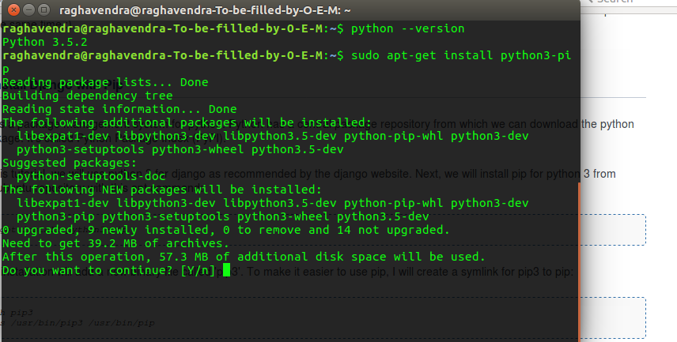

Now set pip of python3 as default

```bash
sudo ln -s /usr/bin/pip3 /usr/bin/pip
```
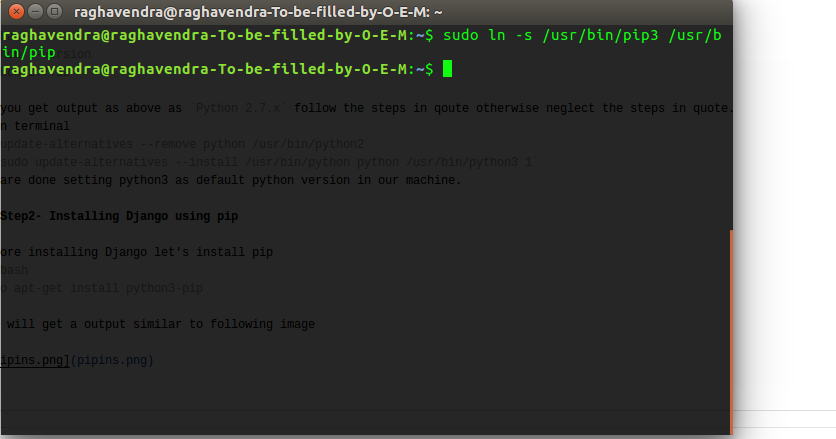

Now let's check whether pip is working or not

```bash
pip -V
```
The output will be in following manner

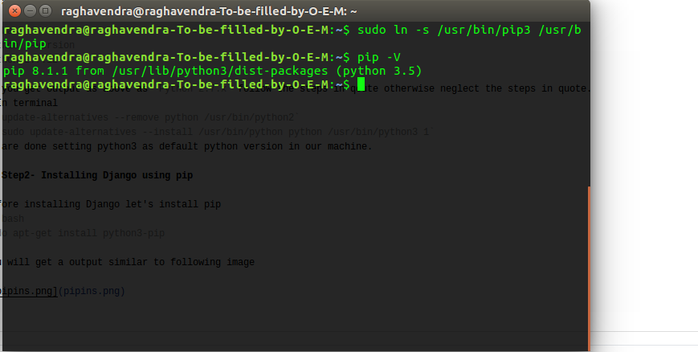

pip installation is done, now let's install django using pip.

```bash
sudo pip install django
```

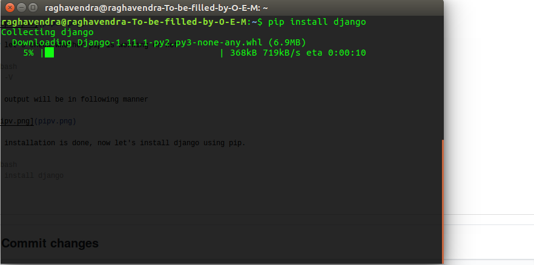

Now let's check whether django is installed or not
```bash
django-admin --version
```
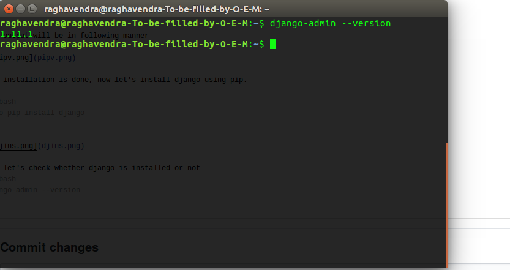

## Step3- Creating a sample project using Django

Create new folder for storing your Django project.

```bash
mkdir project1
cd project1
```
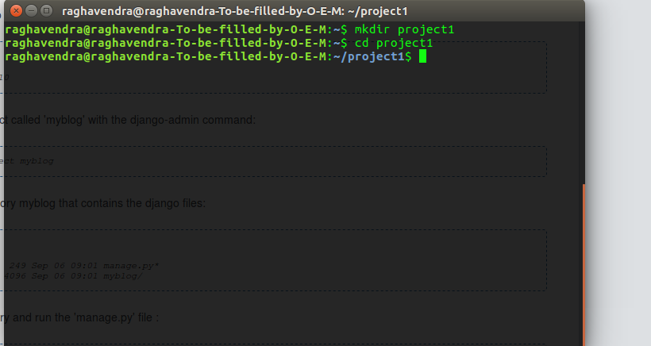

create a django project

```bash
django-admin startproject app
```
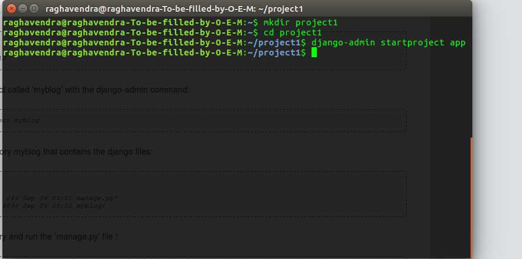

It creates app folder with django files.
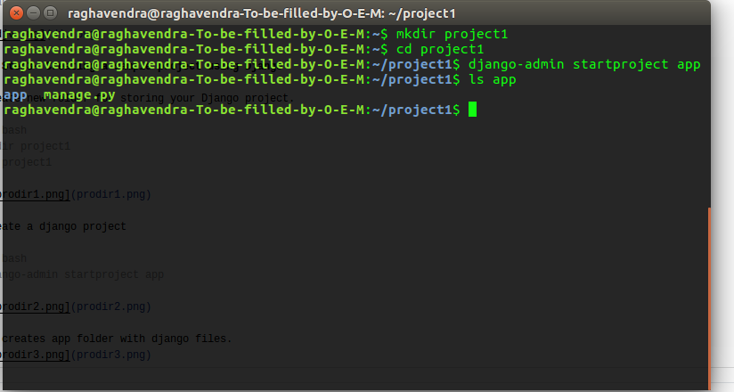

Now start migrate for necessary dependencies to avoid errors using *manage.py*.

```bash
cd app
python manage.py migrate
```
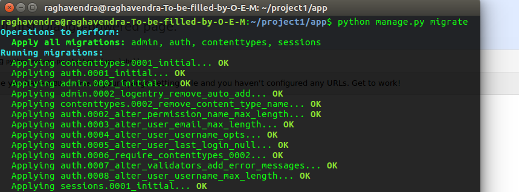

Let's get server working.
```bash
python manage.py runserver
```
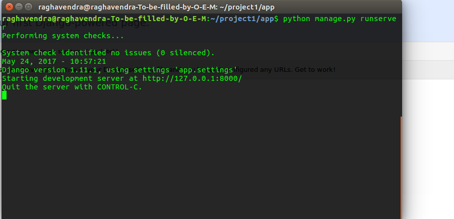

Check whether the server is working or not.

open [localhost:8000](http://localhost:8000/)

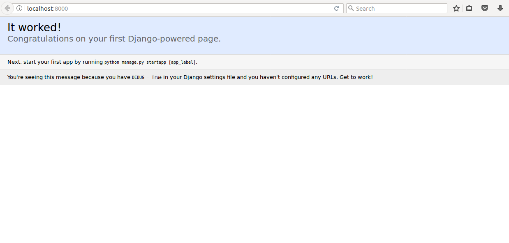

## Making a hello world app

create a application inside project folder.

```bash
django-admin startapp HelloWorldApp
```
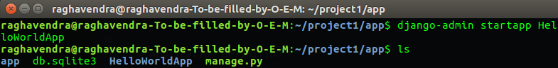

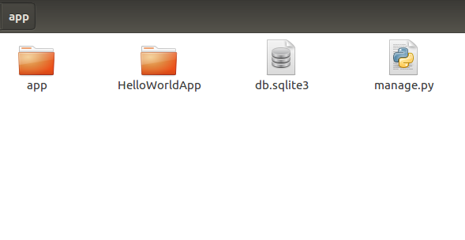

edit the *settings.py* and *urls.py* in project folder(folder name : *app* in my case).

- settings.py

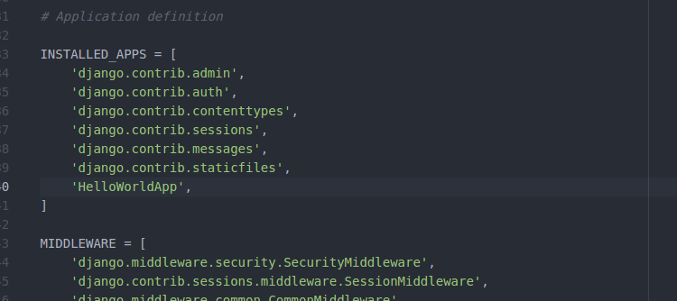


- urls.py

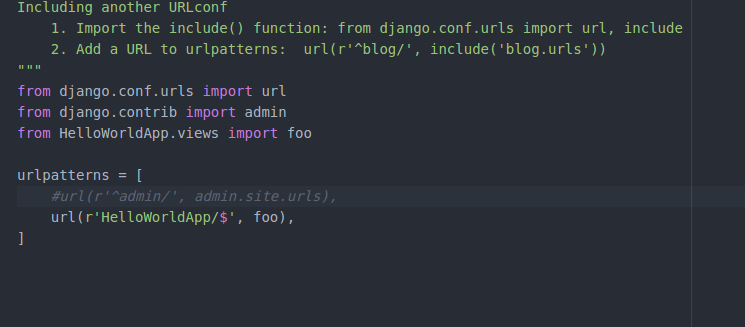


Edit *view.py* in *HelloWorldApp* folder.

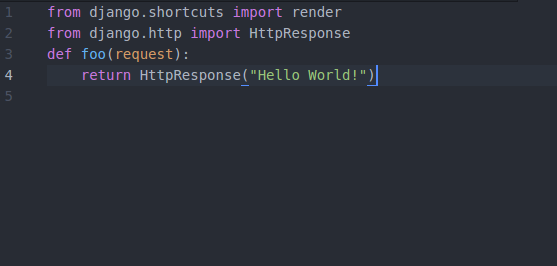

Open [localhost:8000/HelloWorldApp](http://localhost:8000/HelloWorldApp/) in browser by running server by `python manage.py runserver`.

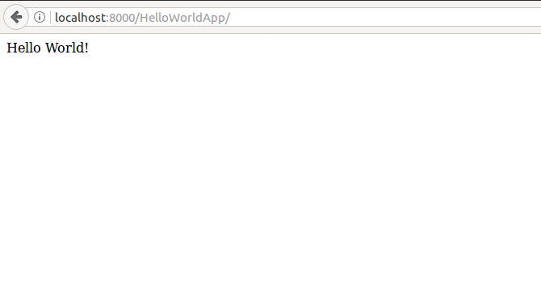

Wow!  :clap: you are now a Django developer.

---
## setting PostgreSQl as database
---
## Prerequisites

A Ubuntu machine(requires **Sudo** privileges for user) with Internet.

## Install the Components from the Ubuntu Repositories

Our first step will be install all of the pieces that we need from the repositories. We will install pip, the Python package manager, in order to install and manage our Python components. We will also install the database software and the associated libraries required to interact with them.


The following apt commands will get you the packages you need:(thinking that you have configured python and)

```bash
sudo apt-get update
sudo apt-get install python-dev libpq-dev postgresql postgresql-contrib
```

With the installation out of the way, we can move on to create our database and database user.

## Create a Database and Database User

By default, Postgres uses an authentication scheme called "peer authentication" for local connections. Basically, this means that if the user's operating system username matches a valid Postgres username, that user can login with no further authentication.

During the Postgres installation, an operating system user named postgres was created to correspond to the postgres PostgreSQL administrative user. We need to change to this user to perform administrative tasks:

```bash
sudo su - postgres
```

You should now be in a shell session for the postgres user. Log into a Postgres session by typing:

```bash
psql
```

First, we will create a database for our Django project. Each project should have its own isolated database for security reasons. We will call our database myproject in this guide, but it's always better to select something more descriptive:

```sql
CREATE DATABASE sampleproj;
```

Remember to end all commands at an SQL prompt with a semicolon.

Next, we will create a database user which we will use to connect to and interact with the database. Set the password to something strong and secure:

```sql
CREATE USER sampleuser WITH PASSWORD 'password';
```

Afterwards, we'll modify a few of the connection parameters for the user we just created. This will speed up database operations so that the correct values do not have to be queried and set each time a connection is established.

We are setting the default encoding to UTF-8, which Django expects. We are also setting the default transaction isolation scheme to "read committed", which blocks reads from uncommitted transactions. Lastly, we are setting the timezone. By default, our Django projects will be set to use UTC:

```sql
ALTER ROLE sampleuser SET client_encoding TO 'utf8';
ALTER ROLE sampleuser SET default_transaction_isolation TO 'read committed';
ALTER ROLE sampleuser SET timezone TO 'UTC';
```

Now, all we need to do is give our database user access rights to the database we created:

```sql
GRANT ALL PRIVILEGES ON DATABASE myproject TO sampleuser;
```

Exit the SQL prompt to get back to the postgres user's shell session:

```sql
\q
```

Exit out of the postgres user's shell session to get back to your regular user's shell session:

```bash
exit
```

We will also install the psycopg2 package that will allow us to use the database we configured:

```bash
pip install django psycopg2
```

## Configure the Django Database Settings

We can now start a Django project within our sampleproj directory. This will create a child directory of the same name to hold the code itself, and will create a management script within the current directory. Make sure to add the dot at the end of the command so that this is set up correctly:

```bash
django-admin.py startproject sampleproj .
```

Now that we have a project, we need to configure it to use the database we created.

Open the main Django project settings file located within the child project directory:

nano ~/sampleproj/sampleproj/settings.py

Towards the bottom of the file, you will see a DATABASES section that looks like this:

```python
DATABASES = {
    'default': {
        'ENGINE': 'django.db.backends.sqlite3',
        'NAME': os.path.join(BASE_DIR, 'db.sqlite3'),
    }
}

```

This is currently configured to use SQLite as a database. We need to change this so that our PostgreSQL database is used instead.

First, change the engine so that it uses the postgresql_psycopg2 backend instead of the sqlite3 backend. For the NAME, use the name of your database (*sampleproj* in our example). We also need to add login credentials. We need the **username**, **password**, and **host** to connect to. We'll add and leave blank the port option so that the default is selected:

```python
DATABASES = {
    'default': {
        'ENGINE': 'django.db.backends.postgresql_psycopg2',
        'NAME': 'sampleproj',
        'USER': 'sampleuser',
        'PASSWORD': 'password',
        'HOST': 'localhost',
        'PORT': '',
    }
}

```

When you are finished, save and close the file.

## Migrate the Database and Test your Project

Now that the Django settings are configured, we can migrate our data structures to our database and test out the server.

We can begin by creating and applying migrations to our database. Since we don't have any actual data yet, this will simply set up the initial database structure:

```bash
cd ~/sampleproj
python manage.py makemigrations
python manage.py migrate
```

After creating the database structure, we can create an administrative account by typing:

python manage.py createsuperuser

You will be asked to select a username, provide an email address, and choose and confirm a password for the account.

Once you have an admin account set up, you can test that your database is performing correctly by starting up the Django development server:

python manage.py runserver

In your web browser, visit your server's domain name or IP address followed by :8000 to reach default Django root page:
[localhost:8000](http://localhost:8000)

You should see the default index page:
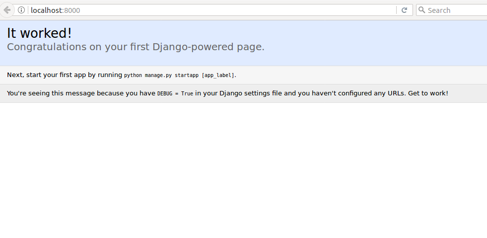

Append `/admin` to the end of the URL and you should be able to access the login screen to the admin interface:

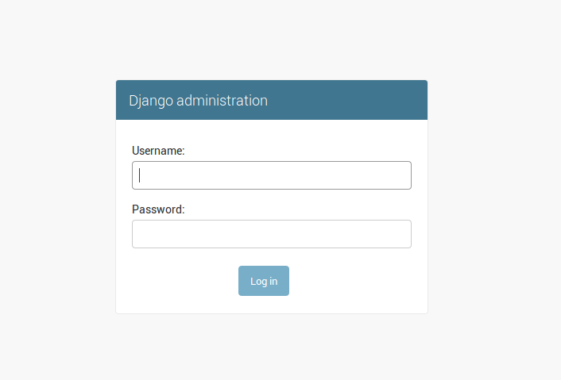

Enter the username and password you just created using the createsuperuser command. You will then be taken to the admin interface:

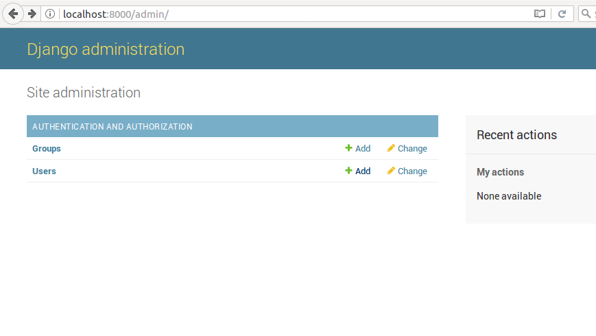

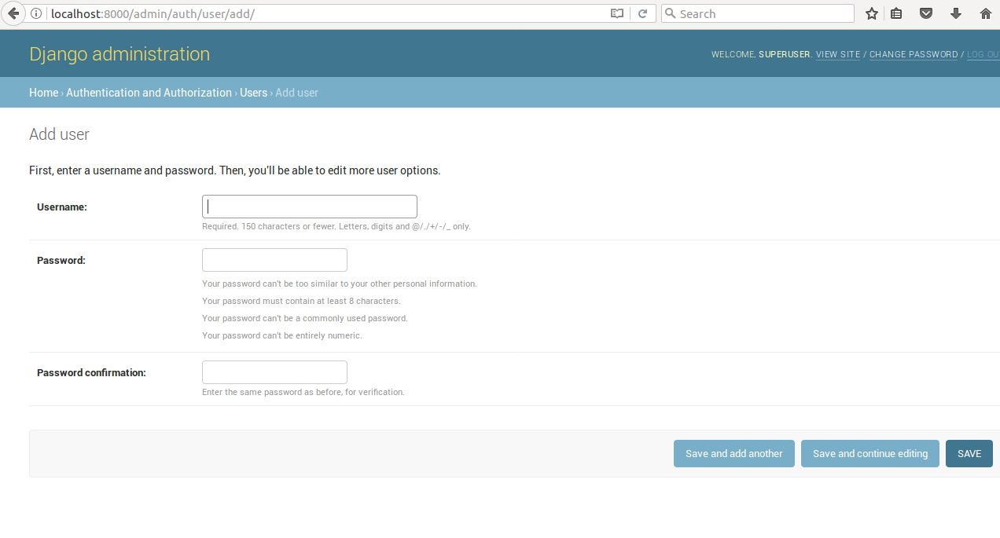

You have successfully set  as working database for 


## setting django server using gunicorn and nginx for deployment
## Prerequisites

A ubuntu machine(with root privileges) with internet

## Installation of Gunicorn and its configuration

we are directly skipping to installation of gunicorn keeping in mind that, you already set python3 as default, created and tested a sample django project after iinstallation of pip and django.
> **NOTE:** If you didnt do any above steps go to
> - [python installation](../python/README.md)
> - [django installation](../django/README.md)

using pip install gunicorn component of python. uWSGI acts as a bridge between the deployment server and the django application.

```bash
pip install gunicorn
pip  install pytz
```
pytz is a gunicorn dependency so you must install it.

Let's test gunicorn's ability to serve the project. We can do this by entering our project directory  and use gunicorn to *WSGI* module
```bash
cd sampleproj
gunicorn --bind 0.0.0.0:8000 sampleproj.wsgi
```
We passed Gunicorn a module by specifying the relative directory path to Django's wsgi.py file, which is the entry point to our application, using Python's module syntax. Inside of this file, a function called *application* is defined, which is used to communicate with the application.you can open the django project without even running server explicitly.

Now Let's  create gunicorn systemd service file

```bash
sudo gedit /etc/systemd/system/gunicorn.service
```
add following lines to opened file.Start with the [Unit] section, which is used to specify metadata and dependencies. We'll put a description of our service here and tell the init system to only start this after the networking target has been reached.[Service] section will specify the user and group that we want to process to run under. We will give our regular user account ownership of the process since it owns all of the relevant files. We'll give group ownership to the www-data group so that Nginx can communicate easily with Gunicorn.Finally, we'll add an [Install] section. This will tell systemd what to link this service to if we enable it to start at boot. We want this service to start when the regular multi-user system is up and running:
```
[Unit]
Description=gunicorn daemon
After=network.target

[Service]
User=raghavendra
Group=www-data
WorkingDirectory=/home/raghavendra/sampleproj
ExecStart=/usr/local/bin/gunicorn --access-logfile - --workers 3 --bind unix:/home/raghavendra/sampleproj/sampleproj.sock sampleproj.wsgi:application

[Install]
WantedBy=multi-user.target

```
With that, our systemd service file is complete. Save and close it now.

> **NOTE:** don't forget to change username and project folder as per your creation in files.

We can now start the Gunicorn service we created and enable it so that it starts at boot:

```bash
    sudo systemctl start gunicorn
    sudo systemctl enable gunicorn
```
checking Gunicorn socket file

```bash
sudo systemctl status gunicorn
```
The output should be similar to :

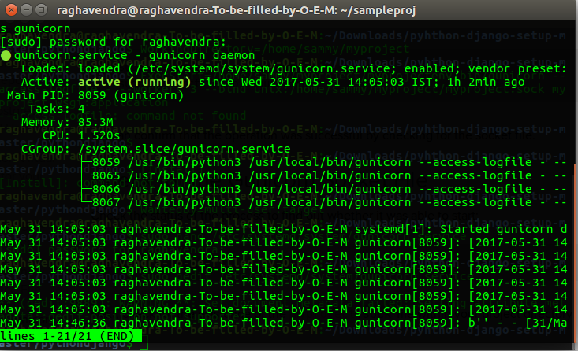

f you make changes to the `/etc/systemd/system/gunicorn.service` file, reload the daemon to reread the service definition and restart the Gunicorn process by typing:
```bash
sudo systemctl daemon-reload
sudo systemctl restart gunicorn

```

## installing and Configuring nginx for deployment

install nginx:
```bash
sudo apt-get install nginx
sudo /etc/init.d/nginx start
```
now check that nginx is serving by visiting [localhost](http://localhost/). If its successful, that means that nginx is listening to port 80 and we need to reconfigure it to listen for port 8000.

configure nginx:

Now that Gunicorn is set up, we need to configure Nginx to pass traffic to the process

start by creatting a new server block in Nginx's `site-enabled` directory:

```bash
sudo gedit /etc/nginx/sites-enabled/sampleproj
```
add following lines to the file opened and don't forget to change username and project folder name:
```
server {
    listen 80;
    server_name server_domain_or_IP;

    location = /favicon.ico { access_log off; log_not_found off; }
    location /static/ {
        root /home/raghavendra/sampleproj;
    }

    location / {
        include proxy_params;
        proxy_pass http://unix:/home/sammy/myproject/myproject.sock;
    }
}
```
let's configure django to accept the domain specified in `server_name`.  Open *sampleproj/setting.py* from project folder and add host to be accepted.
```python
...
ALLOWED_HOSTS = ['.sampleproj.com','localhost']
...
```
lets test Nginx and restart it.
```bash
sudo nginx -t
sudo systemctl restart nginx
```
now lets edit the hosts file to open the domain specified in the server.
```bash
gedit /etc/hosts
```
add the host below the last line specifying hosts starting with `127.0.0.1`:
```
...
127.0.0.1	sampleproj.com
...
```
Now you should see the specified domain(sampleproj.com in mycase) to view you application:

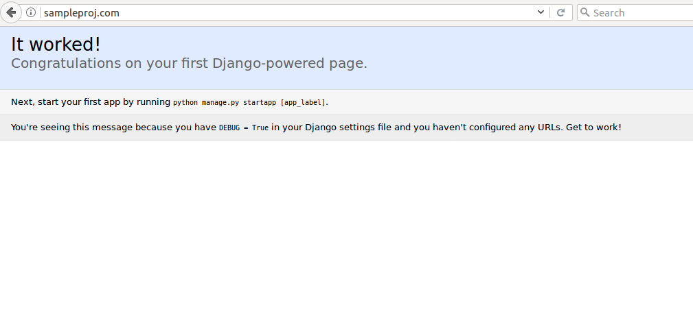
